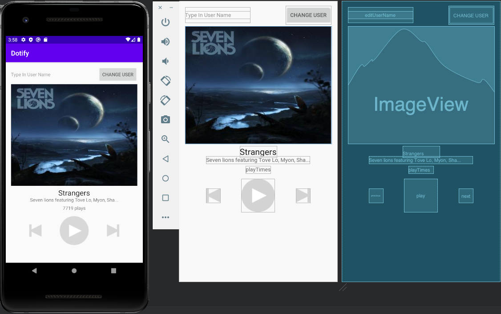

## INFO 448 HW 1 - Dotify Androiod App
### Lizzy Chen

### A. Briefly describes the app
Built on Andriod Stuido, this application aims to eventually provide musics from record labels and media companies. So far the application has a couple of functions developed as listed below:
1. “Change Username” button that can change the username;
2. “Apply” button that can record and present the username after changing the username;
3. Display of name of the current playing song (not actually playing at this stage)
4. Display of the names of the artists

### B. List of extra credit you attempted
N/A

### C. Shows an photo or screenshot of your app running on a device/emulator

### Optional: Any special set up/installation instructions or how to use the app
N/A
