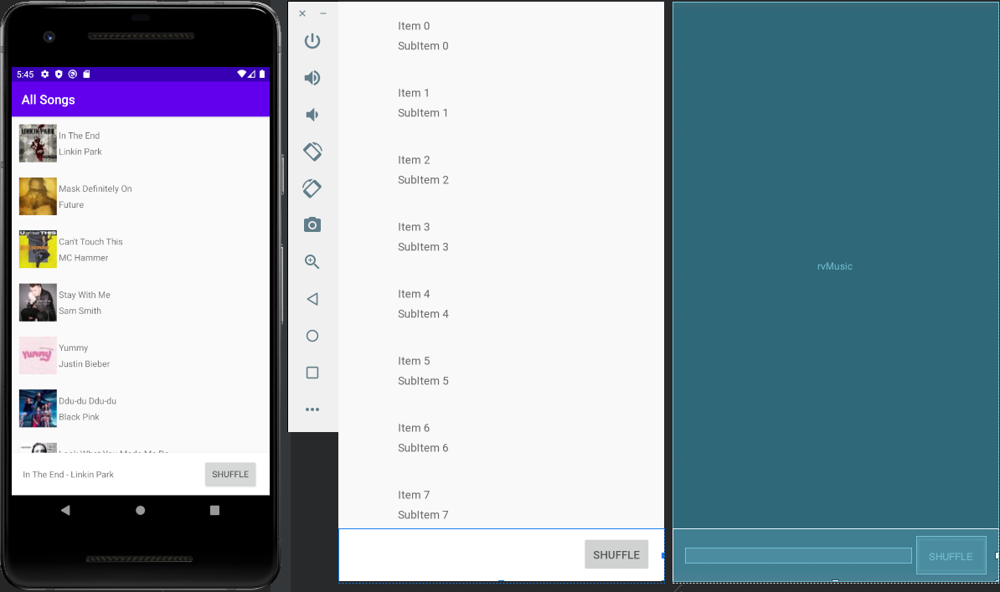

## INFO 448 HW 2 - Dotify Androiod App
### Lizzy Chen

### A. Briefly describes the app

Built on Andriod Stuido, this application aims to eventually provide musics from record labels and media companies. So far the application has a couple of functions developed as listed below:
1. A list of songs' names, artists and album icons (small album image) when initialzing the app. Long click any song, the song would be deleted; there would also be a brief message at the bottom of the screen saying “The song was deleted”
2. “Shuffle” button that can shuffle the order the list when clicked
3. A mini player at the bottom of the app. when the app just gets started, there would be nothing showed in the miniplayer. Short click any song, the name and the artist of the song would show up in the mini player. Then short click the mini player, the app would enter to another page, which is the main page of the song chosen. In the main page, the name, artist and big album image of the chosen song would show up; the rest of the funcitons in this page would be exactly the same as HW1.
4. In the main page of the song, there is a back arrow button to go back to the songs list

### B. List of extra credit you attempted

Extra credit question 1, 2

### C. Shows an photo or screenshot of your app running on a device/emulator

### Optional: Any special set up/installation instructions or how to use the app

N/A
