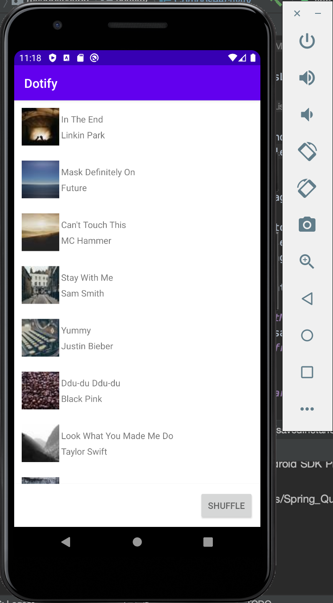
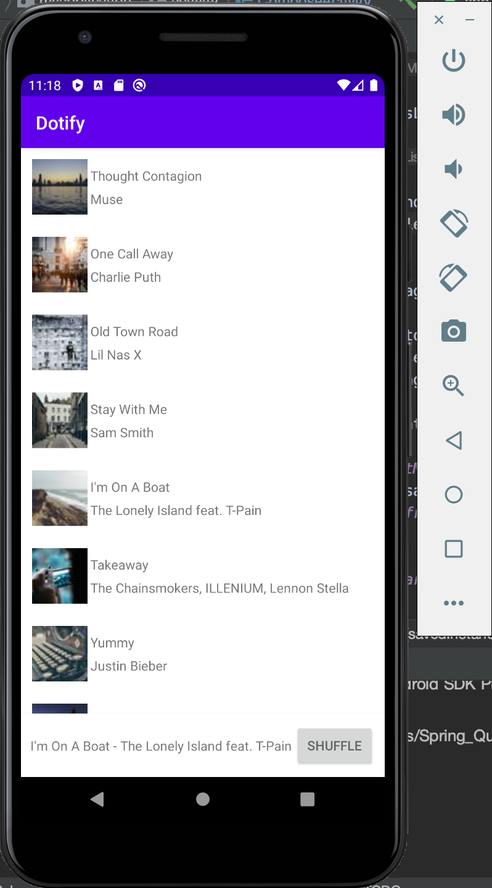
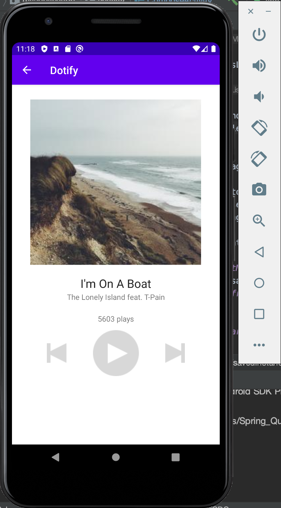
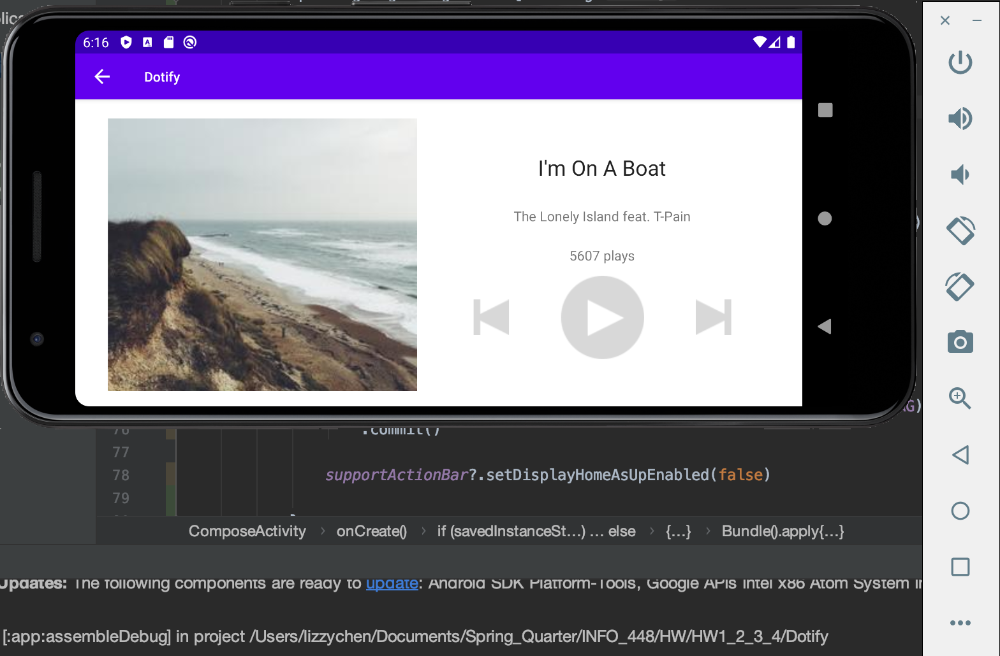
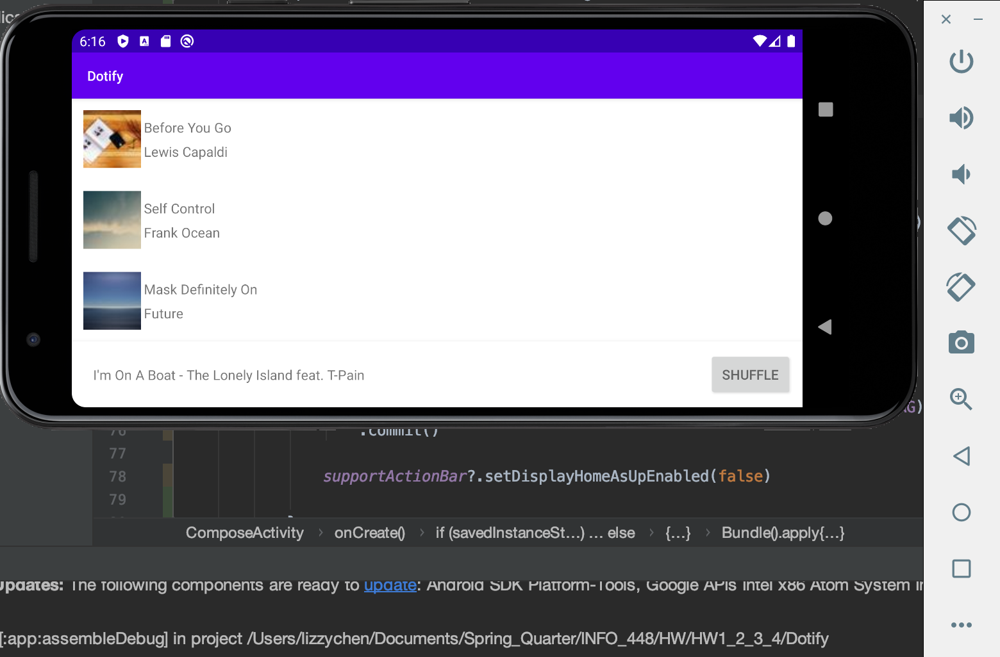

## INFO 448 HW 4 - Dotify Androiod App
### Lizzy Chen

### A. Briefly describes the app

Built on Andriod Stuido, this application aims to eventually provide musics from record labels and media companies. So far the application has a couple of functions developed as listed below:
1. When initializing the app, the app will send an HTTP GET request to some url and receive the data provided. With the data, the app will show a list of songs' names, artists and album icons (small album image)

2. “Shuffle” button that can shuffle the order the list when clicked

3. A mini player at the bottom of the app. when the app just gets started, there would be nothing showed in the miniplayer. Short click any song, the name and the artist of the song would show up in the mini player. Then short click the mini player, the app would enter to another page, which is the main page of the song chosen

4. The features of the main page are:

   a. Display of name of the chosen song

   b. Display of the names of the artists

   c. Display of the number of song plays. Note that when entering the main page, the number displayed would be a random number

   d. A Play Button. When a user clicks on play, it increases the number of plays displayed by one

   e. A Previous Button. When a user clicks on the previous button, it shows a brief message at the bottom of the screen saying “Skipping to previous track”

   f. A Next Button. When a user clicks on the previous button, it shows a brief message at the bottom of the screen saying “Skipping to next track”

5. In the main page of the song, there is a back arrow button to go back to the songs list. After going back from the main page of the song to the song lists, the name of the previous picked song still stay showed in the mini player

6. Rotate on both the song list and the main song pages, the two pages accordingly show their landscape layouts. Rotation would not change any of the above-mentioned function of the app

### B. Shows photos or screenshots of your app running on a device/emulator

### Optional: Any special set up/installation instructions or how to use the app

N/A
